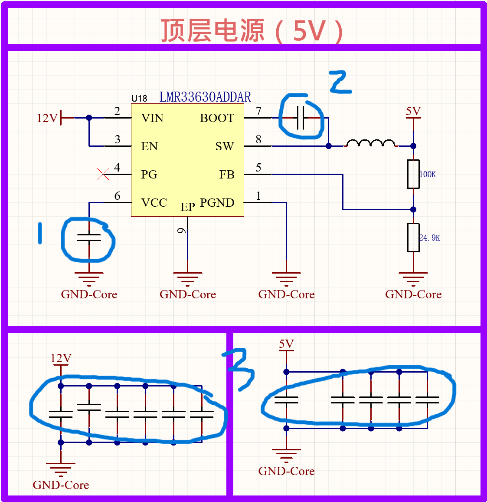

# lmr33630

- 类型：同步整流降压开关转换器
  - 同步：采用低侧mos管（区别于tps5430采用续流二极管）
  - 转换器：芯片内集成mos管，无需额外添加。

- 参数：
    参数类别 | 具体参数
    --- | ---
    输入电压范围 | 推荐：3.8V36V；绝对最大：-0.3V38V（瞬态＜100ns 可达 -3.5V~38V）
    输出电压范围 | 可调：1V~24V（最大可扩展至 VIN 的 95%，需联系 TI 确认）
    输出电流 | 额定 3A；峰值电流限制：高边（I_SC）3.85A5.05A，低边（I_LIMIT）2.9A4.1A
    开关频率 | A 版本：340kHz460kHz；B 版本：1.2MHz1.6MHz；C 版本：1.8MHz~2.4MHz
    效率与功耗 | 峰值效率＞95%；工作静态电流（I_Q）24µA34µA；关断电流（I_SD）5µA10µA
    功率 MOSFET | 高边 R_DS-ON：RNX 封装 75mΩ（典型），DDA 封装 95mΩ（典型）；低边 R_DS-ON：RNX 封装 50mΩ（典型），DDA 封装 66mΩ（典型）
    关键时序参数 | 最短导通时间（t_ON-MIN）：RNX 封装 68ns，DDA 封装 75ns；软启动时间（t_SS）2.9ms~6ms

- 引脚：

    引脚名称 | 类型 | 核心功能 |
    --- | --- | --- |
    PGND | G | 电源地,需连接系统地和 AGND,通过短而宽的走线连接旁路电容 |
    AGND（EP） | G | 模拟地,为内部参考和逻辑提供地参考,需焊接至接地平面以保证电气和热性能 |
    VIN | P | 输入电源端,需直接连接高质量旁路电容至 PGND |
    EN | A | 使能端(高电平导通,低电平关断),可直接接 VIN,禁止浮空 |
    PG | A | 电源正常标志(开漏输出),高电平表示电源正常,需外接上拉电阻,未使用时可浮空 |
    FB | A | 反馈输入端,连接分压电阻抽头,禁止浮空或接地 |
    VCC | P | 内部 5V LDO 输出,**为内部控制电路供电**,需接 1uF 电容至 GND,禁止外接负载 |
    BOOT | P | 自举电源端,需接 100nF 电容至 SW 引脚 |
    SW | P | 开关节点,连接功率电感 |

    >  缩写解释
    > ---
    > A: Analog 模拟信号；P：Power 功率信号；G：GND 地信号\
    > PGND：Power Ground，电源地。\
    > AGND（EP）：Analog Ground，模拟地。\
    > EP：Exposed Pad，裸露焊盘（THERMAL PAD，热焊盘），负责接信号地、散热。**与AGND电气连接，二者等效**。\
    > PG：Power Good，电源正常。\
    > FB：Feedback，反馈。（tps5430中为VSENSE）\
    > SW：SWitch，开关节点。（tps5430中为PH）

# 电路分析

  - 电容1：VCC 退耦电容
      - VCC 为**输出**引脚。
        - VCC 负责**为内部控制电路供电**（如振荡器、栅极驱动器、保护电路、PG 引脚逻辑）。其以芯片内部集成LDO为其输入，无需外部输入。
        - 引出 VCC 的目的是，便于外接大容量电容（uF）为其滤波，以适应大功率、大电流（1A以上）场景。\
        芯片内可集成的大容值 MIM 电容通常仅有几十 nF~ 几百 nF，无法处理大电流时的噪声。
        - 部分稳压芯片（如tps5430）无外接 VCC 引脚。
      - VCC 接大电容后引至 GND。
        - 避免芯片内部噪声 *污染* 信号地。
  - 电容2：自举电容
      - 维持mos管栅极、源极极间压差，保证导电沟道可以正常开启。
        - 在mos管关断时充电至5V；
        - 在mos管需要开启时，栅极电势 *Ug = Usw(Uph) + 5V*，其与源极压差 \
        *|  Ugs | = | 12V - Ug | = 5V*，\
        保证沟道可以正常开启。
        > 详见[电源电路.md](电源电路.md)
  - 电容3：电源滤波电容
    - 抑制电源噪声
      - 不同容量大小电容组合，以便抑制不同频率的噪声。