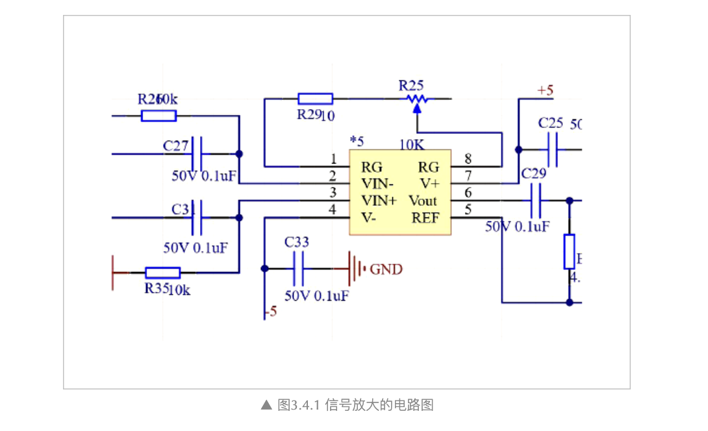
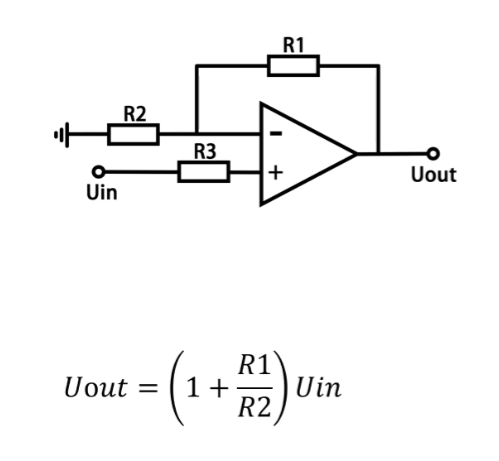
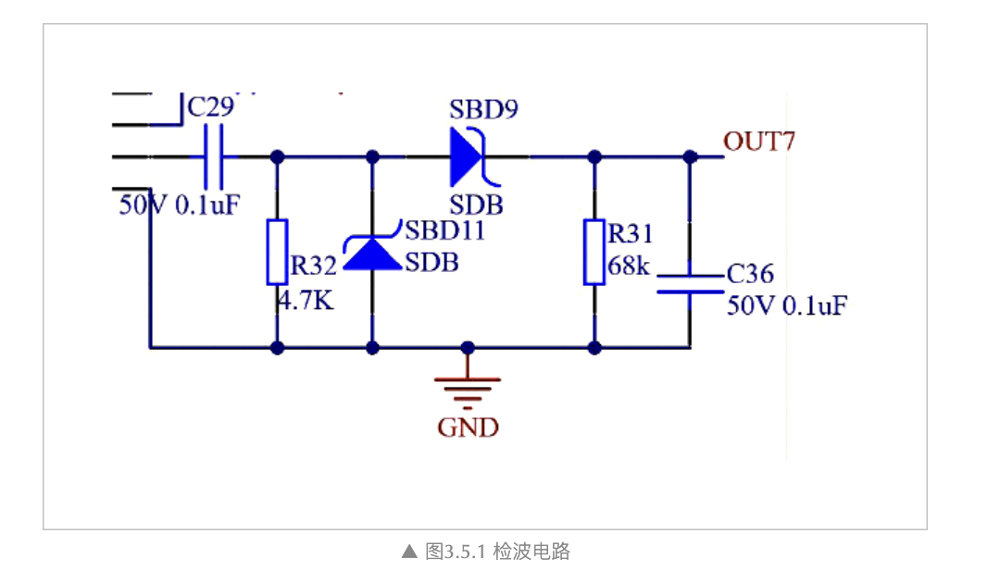
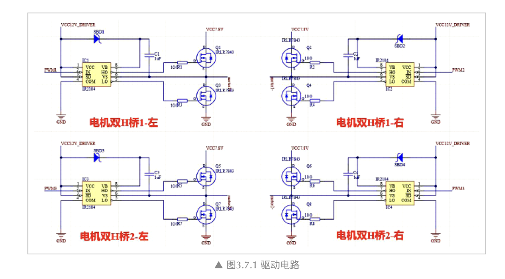

[原文链接](https://zhuanlan.zhihu.com/p/576343220)

# 电路设计部分

## 信号放大电路设计

> 3.4 信号放大电路设计
> ---
> 由于电感感应出来的感应电动势比较小而且是差分信号，所以需要放大电路进行调理。放大电路我们也想到四种。\
> 第一种，**三极管放大**。优点是电路简单，成本低廉。缺点也十分明显，有很严重的零点漂移和温度漂移。当电感几乎没有感应到信号时输出电路就有不小的电压。当温度发生变化时，调试的参数就会发生变化。\
> 第二种，**单电源供电运放**，在放大电路上加上运放电源一半的偏置，对电感的两端输出信号差分放大。优点失调电压小，度好，目前的工艺下高性能的运放价格也不高。缺点是电路比较复杂，共模抑制比小。\
> 第三种，**双电源供电运放**，直接对电感信号差分放大。优点是电路简单，失调电压小，线性度好。缺点是共模抑制比小，一般的电荷泵负向电压纹波比较难控制，运放的工作条件很难得到保证。\
> 第四种，**双电源仪表放大器**，直接放大差分信号。优点是共模抑制比高，线性度高，失调电压小。缺点是负压纹波难控制而且芯片贵。\
> 由于我们采取的方案传感器个数比较少，即使是使用仪表放大器，成本也不会超过预算。因此，为了得到更好的信号，我们采用仪表放大器。如果采用 Rail to rail仪表放大器，就可以用一个比较低的电源电压得到比较大的电压信号。最终我们按照这个思路查找器件选型表，最终选择了仪放。

- 运算放大器
  - 原理：利用差分输入和极高开环增益，通过负反馈实现精确信号运算。
  
  - 负电源：接 V-，处理和输出负电压信号。

- 三极管温漂
  - 工作依赖其静态工作点（Q点），而Q点由偏置电阻和三极管自身的参数（如Vbe、β）共同决定。其参数对温度极其敏感。
  - 开环电路无补偿。

- 单电源运放
  - 偏置：单电源运放的输入和输出电压范围必须在正电源（Vcc）和地（0V）​ 之间。加上Vcc/2偏置后，整个信号被抬升到0V以上，从而落在运放的有效工作区间内。
  - 共模抑制比小
    - 共模信号：正电源与偏置同源，二者理论上相等。
    - 运放本身的共模抑制能力有限（CMRR有限），且外部电阻不可能完全匹配。因此，一部分共模电压（2.5V）会被“泄漏”并转换成差模信号，被错误地放大，导致输出产生误差。

- 双电源运放
  - 多加负电源。
  - 电源噪声大。

# 检波电路

> 3.5 检波电路设计
> ---
> 从仪表放大器出来的信号是类似正弦波的信号。为了将该信号转化成直观的直流电平，我们也从网上参考了三种方法。\
> 第一种，直接对该信号进行**高速采样**。采样速率在信号频率的 20倍以上。放大器出来的信号时 20KHz，那么采样频率就应该在40KHz以上才能算出比较准确的值。这样无疑增加了程序上计算的负担，而且也没有电路转换得到的结果的稳定。\
> 第二种，AD637真**有效值转换芯片**。参照 AD637的 Datasheet，要得到我们所需要精度的有效值需要 100以上的周期，也就是 5ms。这种方法虽然结果准确，但是延时是十分严重的，不适合高速情况下使用。还有一个致命的缺陷是成本太高。\
> 第三种，**运放检波**。这种方法是最稳定，反映最快，效果最好的电路。制作出来的 PCB大小为较小，减轻了车体重量。该电路较为简单，可参考官方的文档《电磁小车设计参考》内的检波电路，在此就不再复述。

- 无源二极管检波
  - 原理：二极管 SBD9 选择交流信号正半周通过，为电容 C36 充电。电容输出相对平滑的直流电压
  - 输入：一个高频调幅信号（AM）。
  - 输出 (OUT7)：一个与输入高频信号包络形状一致的低频（或直流）电压信号。

# 电机驱动

> 3.7 电机驱动电路设计
> ---
> 智能车速度是取得好的成绩的重要条件，由此电机驱动模块的重要性也就不言而喻。\
> 对于电机驱动电路，可有多种选择，像专用电机驱动芯片MC33886、L298N等，但是以上芯片集成度高，导通内阻大，瞬间电流小，驱动效果差。\
> 因此我们选择用H桥的全桥电路，才能够使得车及时刹住，减速入弯。另外，今年四轮电磁组，电机型号为 RN-380。我们大概测试过启动或者堵转时电流可以达到5A(适当的驱动频率下)。\
> 开始我们采用英飞凌的集成半桥芯片 BTS7960B构成H桥来驱动电机，由于速度提升后电机耗电较大，发热严重，同时 BTS的成本也相对比较高。于是我们又开始艰难的尝试新的驱动方案。最终我们找到了 4N-MOS搭的H桥方案，采用内阻小的4片 NMOS来搭建的2个H桥使得单电机驱动问题彻底解决。

- 双桥驱动
  - 可切换电机输入点M、N端电压正负，实现正反转。

