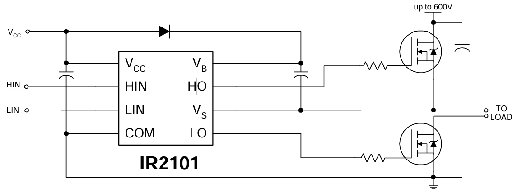

# 半桥驱动电路（以 ir2101 为例）
- 参数
    | 参数项 | 符号 | 数值 / 范围 | 单位 | 备注 |
    |-------|------|-----------|------|------|
    | 逻辑输入电压（HIN/LIN） | VIN | -0.3 ~ VCC+0.3 | V | 输入引脚耐压 |
    | 高侧输出电压（HO） | VHO | VS-0.3 ~ VB+0.3 | V | 接功率管栅极 |
    | 低侧输出电压（LO） | VLO | -0.3 ~ VCC+0.3 | V | 接功率管栅极 |
    | VS 偏移电压 | VS | VB-25 ~ VB+0.3 | V | 高侧参考地耐压 |
    | 高侧浮动电源电压 | VB | -0.3 ~ 625 | V | 含瞬态耐压 |
    | 低侧 / 逻辑供电电压 | VCC | -0.3 ~ 25 | V | 核心供电，超压直接损坏 |
    | 允许电压瞬变率 | dVS/dt | 50 | V/ns | 抗 VS 高压跳变干扰 |
    | 结温 | TJ | 150 | ℃ | 芯片内部最高温度 |

- 引脚
    | 引脚符号 | 核心功能描述 |
    |---------|-----------|
    | HIN | 高侧栅极驱动器逻辑输入 |
    | LIN | 低侧栅极驱动器逻辑输入 |
    | HO | 高侧栅极驱动输出端，外接功率器件（高侧mos管）栅极 |
    | LO | 低侧栅极驱动输出端，外接功率器件（低侧mos管）栅极 |
    | VS | 高侧浮置电源返回端，连接半桥拓扑桥臂中点（实际控制端） |
    | VB | 高侧浮置电源正端，自举电路核心供电引脚 |
    | VCC | 低侧通道与逻辑电路固定电源正端 |
    | COM | 低侧通道与逻辑电路参考地 |

## 电路拓扑

- 功率mos管
  - 高侧：
    - 源极（ S ）：接高压（up to 600V）总线（ Bus ）。
    - 漏极（ D ）：接 VS ，实际控制电机。
    - 栅极（ G ）：接 HO。
  - 低侧：
    - 源极（ S ）：接 GND。
    - 漏极（ D ）：接 VS ，实际控制电机。
    - 栅极（ G ）：接 LO。
    
- 自举电容
  - 在 VB 与 VS 间，高侧mos管打开、VS 输出高压时，抬高栅极电位。
  > 参见[电源电路.md](电源电路.md)

## 工作逻辑

  - 电流流向:\
    **VS → M → 电机 → N → GND**
  - HO、LO交替间隔（死区时间）通断，将 M 拉高或接地。

