# 基础元件

## 电阻

**插接电阻读数:**

- 四段： 
  - 第一、二段 - 读数
  - 第三段    - 乘数
  - 第四段 - 误差
- 五段： 
  - 第一、二、三段 - 读数
  - 第四段 - 乘数
  - 第五段 - 误差

**贴片电阻读数:**

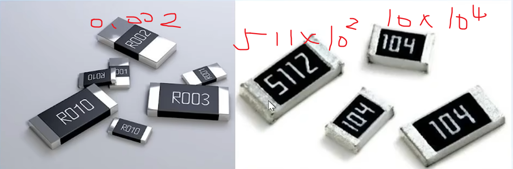
- 三位：
  - 第一、二位 - 读数
  - 第三位 - 10的n次幂
  - 精度 - 5%
- 四位：
  - 第一、二、三位 - 读数
  - 第四位 - 10的n次幂
  - 精度 - 1%
- R：
  - R代表小数点
  
## 电容

> 电容的核心作用是“隔直流、通交流”。\
> 主要功能为：储能（平滑电压）、滤波（滤除杂波）、耦合（传递信号）。

- 常见电容
  - MLCC陶瓷电容
    - 无极性
    - 中高频段滤波较好、容值偏低
  - 钽电容：\
    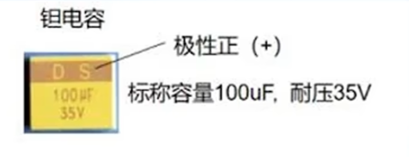

  - 铝电解电容：\
    

  - X电容：\
    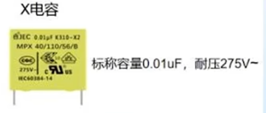
  - CBB电容：\
    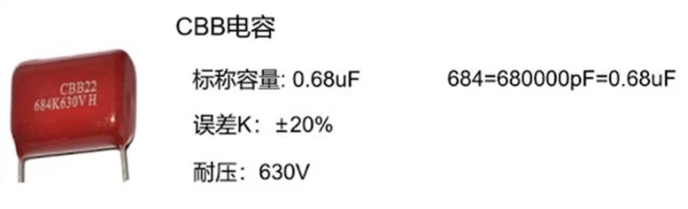

  - 涤纶电容：\
    

- 电容分类

    | 频率 | 种类
    | --- | ---
    | 高频（Mhz - Ghz） | MLCC多层陶瓷电容（贴片）
    | 中频（kHz - 低频Mhz） | 钽电容（贴片）、X电容（插件）、CBB电容（插件）
    | 低频/电源（100hz - khz）| 铝电解电容（贴片或插件）

  - **高频应用**：让高频噪声/干扰电流能够瞬间被短路到地，而不影响信号完整性或电源纯净度
    - 电路不可避免存在**寄生电感（ESL）**，高频电流变化时，感应出的电压将干扰芯片运行。电容可以抑制 ESL 带来的噪声。
      - 电容容抗
        $$ X_{C} = \frac{1}{2πfC} $$
        在高频时低，可吸引高频噪声通过，加快其接地。
    
    - 适用于高频环境的电容，其自身 ESL 应该足够小。而电容C的基本公式有，
        $$ C = \frac{ε \times A}{d} $$
        >其中，ε为介电常数，A为极板面积，d为极板间距。

      - 受限于电容热稳定性、制造工艺，ε 、d不易更改。这意味着：低 ESL 、**适用于高频环境的电容，其容量通常较小**（常见容量：nF - uF）。

    - 使用场景：
      - tps5430的 *Vin* 引脚要求就近连接低 ESL 陶瓷电容至 GND。**（去耦电容）**
        - 就近：降低导线带来的 ESL。
        - *Vin* 所在回路上，高侧mos管以500kHz切换导通、截止状态。低 ESR 陶瓷电容可以低阻抗地响应高频电流。
      - lmr33630的 Vcc 引脚要求接1uF 电容至 GND。**（旁路电容）**
        > 详见[LMR33630电路分析](LMR33630电路分析.md)
    
  - **低频应用**：阻隔或滤除低频信号/噪声，或用于能量存储与缓慢释放（功率电容）。
    - 适用于低频场景的电容对 ESL 要求不高，可以拥有较高的容量。
    - 为了实现能量储存，流经低频电容的电流通常较大。此时，其 **寄生电阻（ESR）** 将导致发热。因此，低频电路对 ESR 要求较高。

    - 使用场景：
        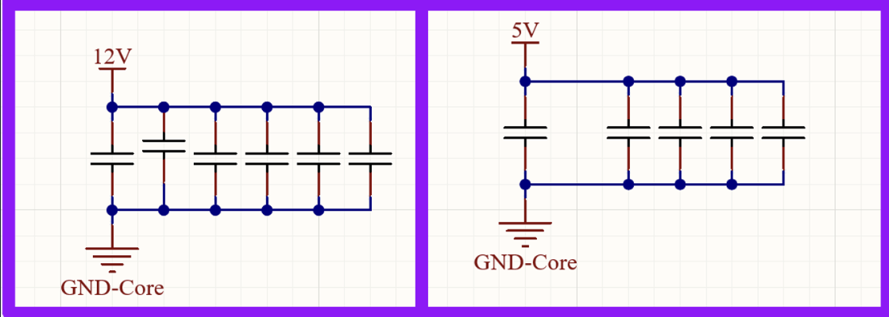
      - 电源滤波。
        > 详见[LMR33630电路分析](LMR33630电路分析.md)

## 电感

> 电感的核心作用是“通直流、阻交流”，用于滤波、储能、抗干扰。
>

**插接电感读数:**

- 读数同插接电阻

**贴片电感读数:**

- 读数同贴片电阻

- 电感分类
    | 频率 | 种类 |
    | --- | --- |
    | 高频（Mhz以上） | 叠片电感、共模电感、环形电感、片式功率电感 |
    | 低频（几百Hz - kHz） | 工字电感、磁棒电感 |
  - 高频应用：处理信号，让想要的信号更纯净、更强地通过，并阻止或削弱不想要的干扰信号。
  - 低频应用：处理能量，储存电能，抑制低频波动。

## 二极管

### PN结

P（Positive）端与N（Negative）端由于其材料的物理性质，富含空穴或电子。二者接触后，电子和空穴会互相扩散，形成内建电场（从N区指向P区）； \
直到达到一个平衡状态，并且在结的中心形成一个耗尽层（因电子和空穴扩散形成的、缺乏载流子的、阻碍多子继续扩散的电场区域）。
- 这样就有PN结的两个性质。
  - **单向导电**：\
    
    外加电场与内建电场**反向**，耗尽层**变窄**，若外加电场强过内建电场，电路**导通**；\
    外加电场与内建电场**同向**，电路保持**截止**，耗尽层**加宽**，若外加电场过强，耗尽层过于稀薄，发生击穿；
  - **可控电容**：\
    PN结的交界面处存在一个充满正负离子的空间电荷区（耗尽层）。电荷的存储与变化，本身就是电容的基本定义。\
    耗尽层的厚度可被外加电场影响，这使得PN结形成电容量可变的电容。

### 各型二极管
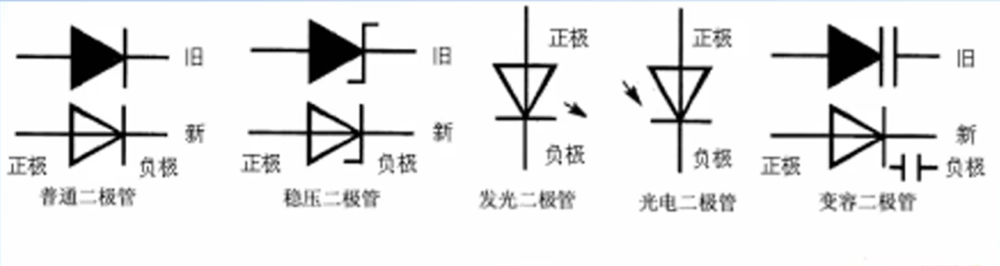
> 二极管的核心作用是单向导电，主要功能为整流、稳压、开关、保护、发光。

---

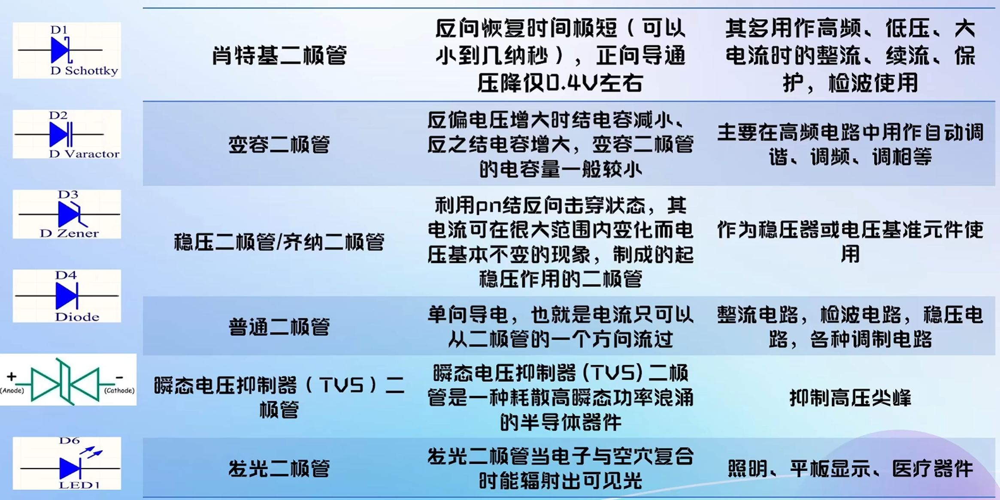
1. **肖特基二极管**（金属与N型半导体结合）
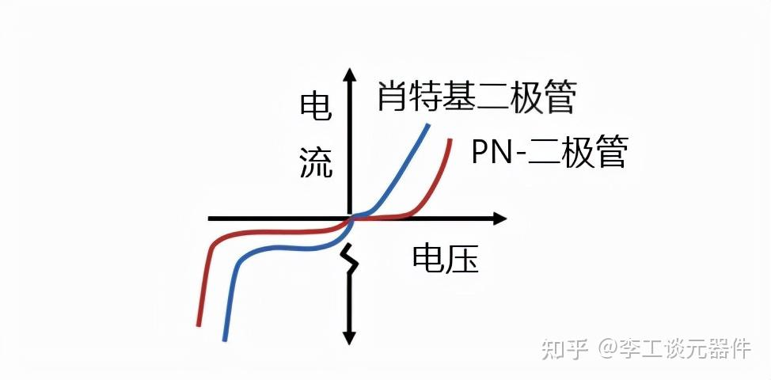
 - 特性：
      - 正向导通压将低；反向击穿电压低
      - 正向电流密度高；反向高电流密度
      - 低结电容；储存电荷少，恢复时间（导通状态与截止状态间切换的时间）快
      - 功率低；噪声小

- 核心作用：实现超高速、低损耗的电流单向导通。

- 主要应用场景：适用于高频、低压、大电流的场合，如开关电源的整流、续流保护、以及高频检波电路。

2. **变容二极管**

- 特性：\
    当其反向偏置电压变化时，内部耗尽层的厚度改变，类比电容器两极板的间距拉大，内部的结电容会随之改变（电压增大电容减小，反之亦然）。
- 核心作用：作为一个电压控制的**可变电容器**。

- 主要应用场景：主要用于高频电路的频率调谐与控制，如收音机/电视的自动调谐、手机中的压控振荡器、调频和调相电路。

3. **稳压二极管**（齐纳二极管）

- 特性：**齐纳击穿**
  - 在**反向特性区**（稳压二极管在电路中反接），外加电场达到击穿电压后，材料中原先被共价键束缚的大量电子会被激活，瞬间产生大量载流子。\
  在击穿区，载流子数量将持续随电场场强升高而快速增加。
  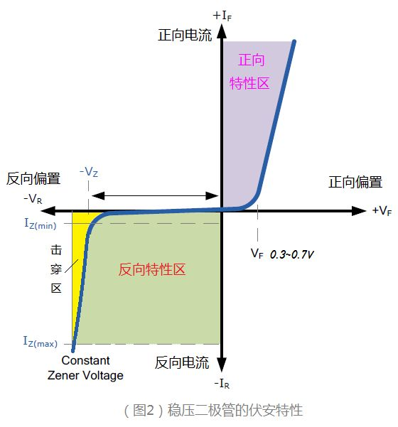
  - 击穿后，若外加电场继续增强，载流子数目快速增加，电流增减，这使得**干路上限流电阻**（稳压二极管总是需要与一个限流电阻串联工作）分压快速增大，使得稳压二极管两端电压稳定，从而保护与稳压二极管并联的元件（**干路上限流电阻**与被保护元件也串联）。

- 核心作用：提供稳定的电压基准或进行简单电压稳压。

- 主要应用场景：常用作各种电路的稳压器或电压基准源，例如为模拟电路提供参考电压，或在电源中进行钳位保护。

4. **瞬态电压抑制二极管**（ TVS二极管）

- 特性：**雪崩击穿**

  - 与齐纳击穿相似，但击穿电压更高，同时响应时间更短，击穿曲线更陡峭，能量耗散更大。
  - 与被保护元件并联，两端电压低于**反向关断电压（VR）时**，TVS二极管不工作，不导通；高于**击穿电压（VBR：略高于反向关断电压）**时，导通，使两端电压低于**钳位电压（VC）**。**峰值脉冲电流（IPP）**为保护装置可以承受的最大电流。

- 核心作用：吸收和钳制瞬间高压脉冲，保护后端精密电路。

- 主要应用场景：用于防浪涌和防静电保护，常见于通信接口（如USB、HDMI）、电源端口、汽车电子等，以抑制雷击、感性负载切换等产生的高压尖峰。

5. **发光二极管**

    - 特性：当电流流过时，电子与空穴复合并以光子形式释放能量（可见光或红外光）。

    - 核心作用：将电能直接转化为光能（电致发光）。

    - 主要应用场景：广泛用于指示灯、显示屏背光、通用照明（LED灯）、大屏幕显示、以及各类光电设备中。

## 三极管
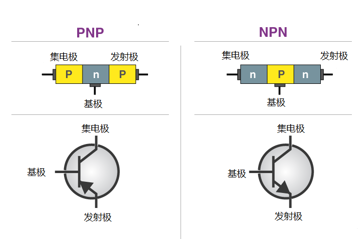
> 三极管的核心应用场景包括信号放大（如音响设备）、电子开关（如数字电路）、振荡电路（如无线电发射）以及电压/电流的稳压与调节。

### PNP型三极管

- **工作原理**：
  - 发射结正偏（发射极电压 > 基极电压）导通，产生大量空穴作为载流子，由P型发射极流向N型基极；\
集电结反偏（集电极电压 < 基极电压），内建电场被增强，使得载流子快速通过P型集电极。\
  从而形成 **从发射极（E）到集电极（C）** 的电流。
  - N型基极接负电压，外界电子流入基极，与来自P型发射极的空穴发生复合相消。复合时，\
  ***发射极产生的空穴数 = 穿过基极的空穴数 + 与基极电子复合相消的空穴数***。
  因此有，\
  ***Ie = Ib + Ic***，
  其中***Ie***、***Ib***、***Ic***分别为发射极电流、基极电流、集电极电流。\
  材料特性保证，\
    ***α = 与基极电子复合相消的空穴数 / 穿过基极的空穴数***，
    其中***α***为定值。\
  因此有，\
  ***Ic = β \* Ib***，
  其中***β***为定值，且通常极大。
  - 降低基极电势时，发射结电压差（P型发射极与N型基极间的压差）增大，由PN结特性，发射极产生的载流子数目将大幅增加，即***Ie***大幅增大。同时***Ib***、***Ic***也将增大，且二者比例***β***不变。
  - 综上，PNP三极管可实现：\
  **用一个微小的基极电流（Ib），去控制一个在集电极与发射极之间流动的、大得多的电流（Ic），从而实现电流放大和开关控制。**

### NPN型三极管

- **工作原理**
  - 与PNP型三极管大体相同。
  - 载流子：电子（PNP型为空穴）
  - 接法：
    - 基极（B）：接正（PNP型接负）
    - 发射极（E）：接正（PNP型接负）
    - 集电极（C）：接负（PNP型接正）
    - 共同点：**发射结正偏，集电结反偏**
  - 电流方向：
    - **从C到E**（PNP型为从E到C）
    - 共同点：**载流子从E到C**，载流子电性决定电流方向。
    
### 输出特性曲线（以PNP型为例）

- *Ib ≈ 0* 时：
   -  截止区：电路断开，*Ic = 0*
- *Ib* 较大时：
   - 饱和区：**集电结的载流子收集能力达到饱和**
      - *Uc = Uec - Ic \* Rc*，\
        其中*Uc*为集电极电势，*Uec*为发射极、集电极两端电压，*Rc*为集电极电阻。
      - 若*Uec*较小而*Ic*较大，则使*Uc ≤ Ub（基极电势）*。
        这意味着集电结为零偏置或正向偏置，其内建电场无法起到加速载流子通过的功能，甚至反过来阻碍载流子通过。
      - 那么，*Ic*取决于集电极接收载流子的能力，而非基极流出载流子的能力，\
        *Ic ≈ Uc / Rc*。
   - 放大区：**基极电流对集电极电流的控制作用被放大**
      - *Uec*增大使得*Uc*增大，集电结恢复反偏。
      - 那么，*Ic*取决于基极流出载流子的能力，由前述工作原理，有\
        *Ic = β \* Ib*。

### 应用场景
- 电子开关：
  - 控制*Ib*，在截止区与饱和区切换。
- 放大信号：
  - 信号为*Ib*，稳定在放大区工作。

### 封装

>三极管不对称，集电极与发射极不能互换 >: O

## 场效应管

### N沟道增强型MOS管

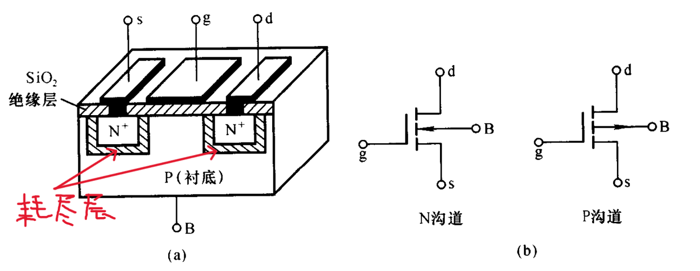

- 工作原理：
  - 基极（B：Base）为P型半导体；源极（S:Sourse）、漏极（D：Drain）为N型半导体；栅极（G：Gate）为金属板。\
    g极金属板与B极半导体绝缘。
  - gB极间结构类似电容器，当给gB极间施加电压时，g极金属层聚集正电荷，它们排斥P型衬底靠近一侧的空穴，使之剩下不能移动的负离子区，另一方面将衬底的自由电子吸引到耗尽层与绝缘层之间，形成了一个N型薄面，被称为**反型层**。\
    实践中，我们将**B极与s极短接**，以减少需控制的引脚，因此gB极间压差与gs极间压差等效。
   
  - 这个由gs极间压差形成的反型层就构成了导通ds两极的导电沟道，使沟道刚形成的gs极间的电压称为**开启电压*Uth***。
    *Ugs*越大，反型层越厚，导电沟道电阻越小。\
    导电沟道形成后，给ds极间施加电压*Uds*，产生漏极电流*Id*。

  - 随着*Uds*增大，*Id*也增大。但是，d极电势升高将使得*Uds*减小，从而使导电沟道**变窄**。\
    直至*Uds = Ugs*时，d极附近导电沟道关闭。
    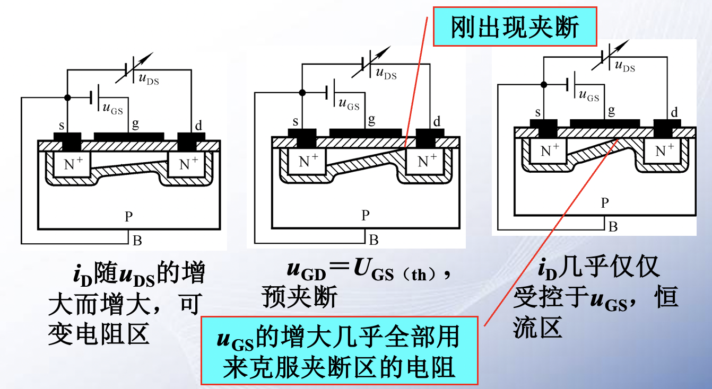

### 输出特性曲线（以上述类型为例）
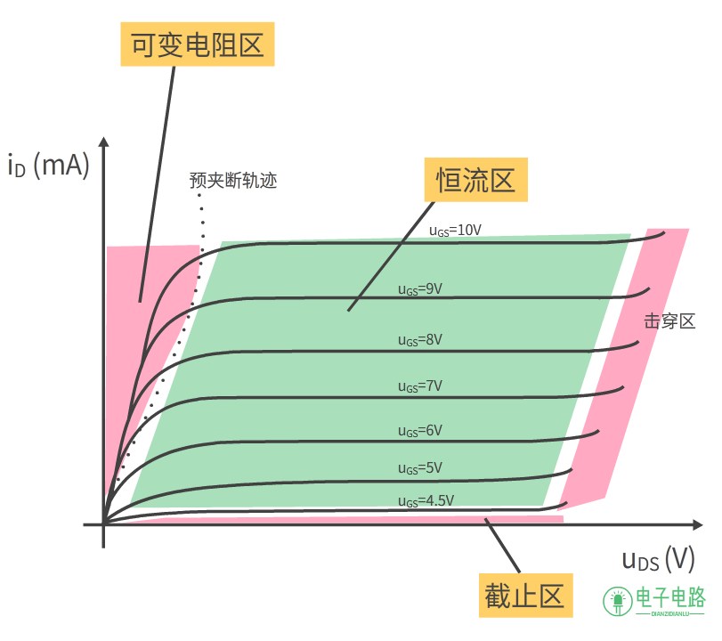

- *Uds ≈ 0* 时：
  - 截止区：沟道关闭，*Id ≈ 0*。
- *Uds* 较大时：
  - 可变电阻区：**类似一个阻值可以通过*Ugs*来精确控制的线性电阻**
    - 线性电阻：当*Ugs*固定为一个大于阈值电压的值时，*Id*会随着*Ugs*的增加而几乎线性地增加。
    - 阻值受控于栅压：这个线性电阻的阻值不是固定的。*Ugs*越大，曲线的初始斜率就越陡峭，意味着在相同的*Ugs*下，*Id*更大，因此计算出的阻值越小。
  - 恒流区：
    - 受控恒流源：当Uds增大到超过某一值（即Uds > Ugs - Uth）后，Id基本不再随Uds的增加而变化，保持恒定，表现出一个恒流源的特性。
    - 电流受栅压控制：这个饱和电流Id(sat)的大小主要（或者说唯一）由栅源电压Ugs决定。Ugs越大，对应的饱和电流也越大。
- *Ugs*过大：
  - 爆爆爆。

