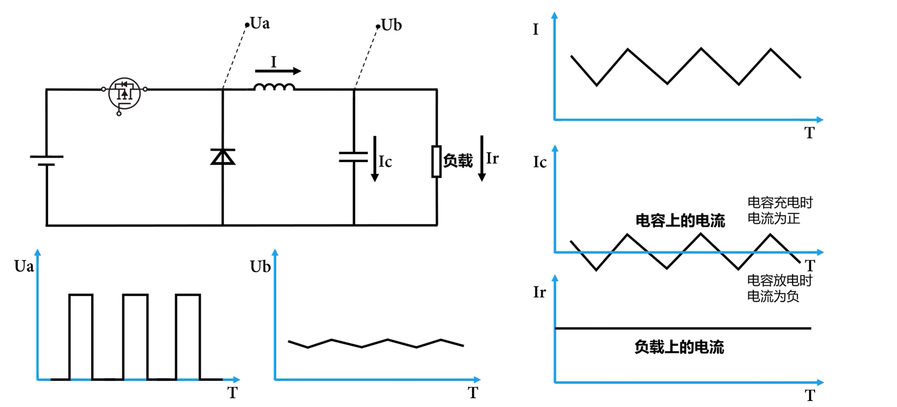
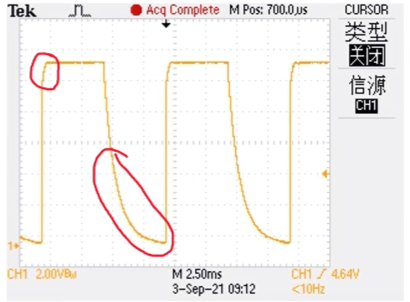
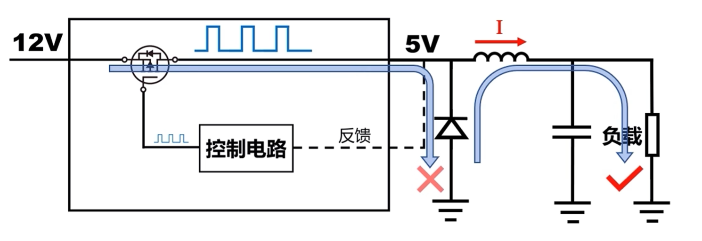
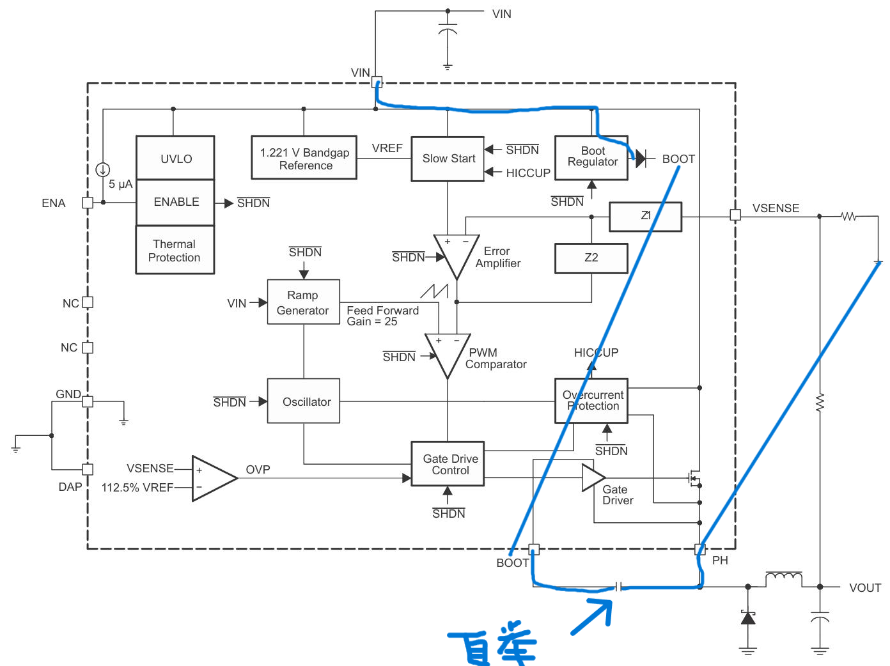

# DCDC LDO对比

特性维度 | DCDC (开关电源) | LDO (低压差线性稳压器)
---|---|---
工作原理 | 开关切换、电感储能 | 线性调整 (晶体管工作在线性区)
效率 | 高 (通常 >80%, 可达 95%+) | 低 (效率约等于 *Vout*/ *Vin* , 压差大时损耗严重)
压差要求 | 可升可降 | 要求输入电压略高于输出电压 (通常 0.2V~1V)
输出噪声 | 较大 (有开关频率噪声) | 极小
发热 | 较小，使用低侧mos管后理论上无发热元件 | 较大，高侧mos管产热消耗多余功率
静态电流 | 相对较高 | 可以做到非常低
电路复杂度 | 高 (需电感、开关管、续流二极管等) | 低 (通常只需输入输出电容)
成本与面积 | 较高, 占用 PCB 面积大 | 较低, 占用面积小
典型应用 | 电池供电设备、大电流、高压差、需要升降压的场合 | 噪声敏感电路 (如模拟/RF)、小压差、小电流、需简单电源的场合

# DC-DC电路（以12V-5V Buck电路为例）

## 核心原理

1. **斩波：**\
    通过一个高速开关管（如MOSFET），将连续的12V直流电“切碎”成一系列高频的脉冲电压。这些脉冲的平均电压（高低电平按时间比例计算）就是我们想要的目标电压。
2. **滤波：**\
    通过电感与电容的组合，将间断的高压脉冲电流平滑为连续的低压电流。

## 电路拓扑结构

- 开关mos管（高侧mos管）
  - 特性：开关恢复速度快，损耗小。
  - 作用：受**降压芯片（详见后文）**控制，通过高速切换导通、截止状态，发挥*斩波*的作用，生成高压脉冲。
  - 实际效果：\
    

- 电容
  - 特性：
    - 通过储存电荷并维持极板间电压，在DCDC稳压电路中快速的充放电，直接缓冲电压突变、吸收纹波电流，从而平滑输出电压。
    - 根据电容瞬时电流公式，
        $$ I(t) = C \frac{dU}{dt}, $$
        电容两端**电压不能突变**，否则将产生瞬时大电流。
  - 作用：平滑高压脉冲。
  - 实际效果：单靠电容无法将脉冲转化为平稳的恒定电流。
      - MOS管导通：电容两端电压突变大，电流*I*会急剧增大，形成*I−T*图中的尖峰脉冲。
      - MOS管稳定：电流*I*稳定。
      - MOS管截止：电容通过放电回路缓慢放电（这里电容两端电压没有突变），电压缓慢下降，依次电流*I*会缓慢减小，形成*I−T*图中的缓降红线。
    
    - 实际电压如图:可以在一定程度上平滑，但效果欠佳。\
     
    
- 电感
  - 特性：
    - 电感在DCDC稳压电路中的核心作用是以磁场形式储能，通过抑制电流突变来稳定电流，从而实现电压的转换与平滑。
    - 根据电感瞬时电流公式，
        $$ U(t) = L \frac{dI}{dt}， $$
        电感流经**电流不能突变**，否则突变将产生瞬时大电压。
    - 作用：进一步平滑高压脉冲。
    - 实际效果：进一步将脉冲转化为平稳（电流中的起伏为*纹波* ）的电流。\
        
    
- 续流二极管/低侧mos管
  - 特性：
    - 续流二极管：单向导通，简单但存在持续功率消耗。（**异步整流**）
    - 低侧mos管： 与前述开关mos管始终保持相反的启闭状态，可实现低功率消耗。（**同步整流**）
  - 作用：
    - 保持流经电感电流不发生突变，同时防止电源短接。
      
      - 在mos关闭瞬间，为电感电流提供一条低阻抗的释放通路，使电流得以连续。避免电感与负载的回路断开，进而产生瞬时大电压。

## 降压芯片

### tps5430

- 类型：异步整流降压开关转换器
  - 异步：采用续流二极管
  - 转换器：芯片内包含高侧mos管，无需额外添加。

- 参数：
  - **输入输出**：TPS5430输入5.5V-36V、TPS5431输入5.5V-23V；连续输出电流3A、峰值4A，输出电压可调节至1.22V，初始精度1.5%；
  - **效率与开关**：集成100mΩ高侧 MOSFET，最高效率95%；固定500kHz开关频率，适配小型滤波元件；
  - **功耗**：非开关静态电流2-4.4mA，ENA 关断后电源电流低至15μA（典型）/50μA（最大）；
  - **工作环境**：工作结温 **-40°C 至 125°C**，贮存温度 **-65°C 至 150°C**，采用 8 引脚 SO PowerPAD™（DDA）热增强封装，提升散热性能。

- 引脚：

    引脚名称 | 编号 | 类型 | 核心功能与要求
    ---|---|---|---
    BOOT | 1 | O | 高侧 FET 栅极驱动自举端（实际为栅极驱动器（Gate Driver）的电源端），接0.01μF 低 ESR 电容至 PH 引脚
    VSENSE | 4 | I | 反馈电压端，接输出电压分压器，稳态电压等于 1.221V 基准
    ENA | 5 | I | 使能端，<0.5V 关断，>1.3V 启用，悬空可直接启用（内部上拉电阻使能）
    GND | 6 | - | 地，必须与 DAP 散热焊盘连接
    *Vin* | 7 | - | 电源输入，需就近接低 ESR 陶瓷电容至 GND
    PH | 8 | I | 连接高侧 MOSFET （开关mos管）源极，接外部电感、续流二极管
    DAP | - | - | 散热焊盘，必须接地以保证正常工作和散热

- 工作逻辑：
 
  >  电解电容 弧线标识负极
  
  1. 启动阶段\
上电与 UVLO 检查： *Vin*  上电，UVLO 模块检测输入电压，当 *Vin* > 5.5V 时，解除欠压锁定。
     1. 使能生效：ENA 引脚拉高或悬空，ENABLE 模块解除 SHDN（Shutdown：关机）信号，芯片开始工作。
     2. 慢启动：Slow Start 模块逐步提升基准电压，限制误差放大器输出，从而缓慢增加 PWM 占空比，避免启动浪涌电流和输出过冲。
     3. 基准建立：1.221V 带隙基准稳定，为整个控制环路提供参考。
  2. 稳态调节阶段（电压模式 PWM）
      1. 电压采样：VSENSE 引脚通过外部电阻分压网络采样输出电压**Vout**。
      2. 误差放大：采样电压与 1.221V 基准在 Error Amplifier 中比较，产生误差电压。内部 Z1、Z2 补偿网络确保环路稳定。
      3. 斜坡生成：Ramp Generator 根据 *Vin* 生成斜坡电压（电压前馈增益 = 25），以改善线路调整率。
      4. PWM 比较：误差电压与斜坡电压在 PWM Comparator 中比较，生成 PWM 脉冲，决定高侧 MOSFET 的导通时间。
  3. 功率转换：
      - MOSFET 导通：Gate Driver 驱动高侧 MOSFET 导通，电流从 *Vin* 经 MOSFET、PH、电感流向负载，电感储能。
      - MOSFET 关断：MOSFET 关断，电感通过外部续流二极管续流，维持输出电流。
      - 占空比调节：占空比 *D ≈ *Vout* /  *Vin* * ，通过不断调节占空比稳定输出电压。
  4. 保护阶段
      - 过流保护 (OCP)：Overcurrent Protection 模块逐周期检测高侧 MOSFET 电流，超过限值时触发 HICCUP 模式，周期性关断并重启，避免持续过流损坏器件。
      - 过压保护 (OVP)：当 VSENSE 电压超过 112.5% × 1.221V 时，OVP 比较器触发，强制关断高侧 MOSFET，防止输出过压。
      - 热关断 (TSD)：Thermal Protection 模块检测结温，超过 135-162°C 时触发 SHDN，关断芯片，结温降低后自动重启。
      - 全局关断 (SHDN)：任何保护触发或 ENA 拉低时，SHDN 信号会关断整个芯片，包括振荡器、PWM 比较器和 Gate Drive Control。

- 工作详解：
  - mos管栅极控制：
    1. 电压采样：通过外部（需额外搭建）采样电路（R1+R2构成分压网络），把输出高压转换成 VSENSE 可识别的低压。
    2. 误差计算：通过比较1.221V基准电压与 VSENSE 实际电压之差，放大（上万倍）后得到“准”误差电压 *Verr0*。
    3. 误差补偿：
       - 如果 *误差放大器* 直接输出误差电压去控制 PWM，整个反馈环路会发生振荡，原因是：功率级（电感、电容、MOS 管）存在寄生电感、电容，且 PWM 控制有延迟，会导致反馈信号的相位滞后，高增益下极易振荡。
       - “准”误差电压 *Verr0* 经 *III 型补偿网络*（不用外部设计，芯片已集成），得到误差电压 *Verr1*，以此驱动 *PWM比较器*。
    4. PWM比较器：
       - *Verr < 0*: PWM 占空比增大，提升输出电压；
       - *Verr = 0*: PWM 占空比不变，保持输出电压；
       - *Verr > 0*: PWM 占空比减小，降低输出电压；
    5. 栅极控制：*PWM比较器* 指令经 *栅极驱动逻辑模块*（负责死区时间控制、接收全局SHDN信号），最终控制高侧mos管栅极，将 *Vin* 引至 PH 引脚。
  - mos管自举电路：
    - 意义：维持*Vgs > Vth*，保证沟道开启。
      - 芯片内高侧mos管常见情形：
        - 漏极 (D)：接输入电压 *Vin*（比如 12V）。
        - 源极 (S)：接开关节点 PH（电位在 0V 和 12V 之间跳变）。
        - 栅极 (G)：控制端。
      - 如无自举电路，当mos管开启，*Us = Vin*时，*Vgs < Vth*，沟道关闭。
    - 工作原理：
      - mos管关断时，PH 引脚输出0V，经路线（如前图蓝线所示）：\
        *Vin → 内部二极管 → BOOT引脚 → 自举电容 → PH引脚  → 地*，\
        自举电容充电至5V，此时 BOOT 引脚电位*Uboot = 5V*。\
        BOOT 引脚 *连接栅极驱动器*（Gate Driver）的电源端。
      - mos管导通时，PH 引脚输出12V，*Uboot = Uph + 5V = 12V*。\
        此时，*Ugs = Uboot - Uph = 5V > Uth*，导电沟道可以形成。

### mp2315s
- 类型：同步整流降压开关转换器
  - 同步：采用续流mos管
  - 转换器：开关mos管与续流mos管均集成在芯片内部，无需额外添加