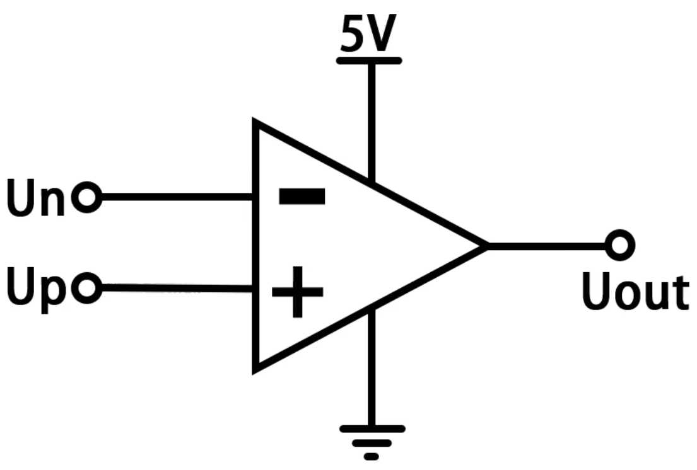
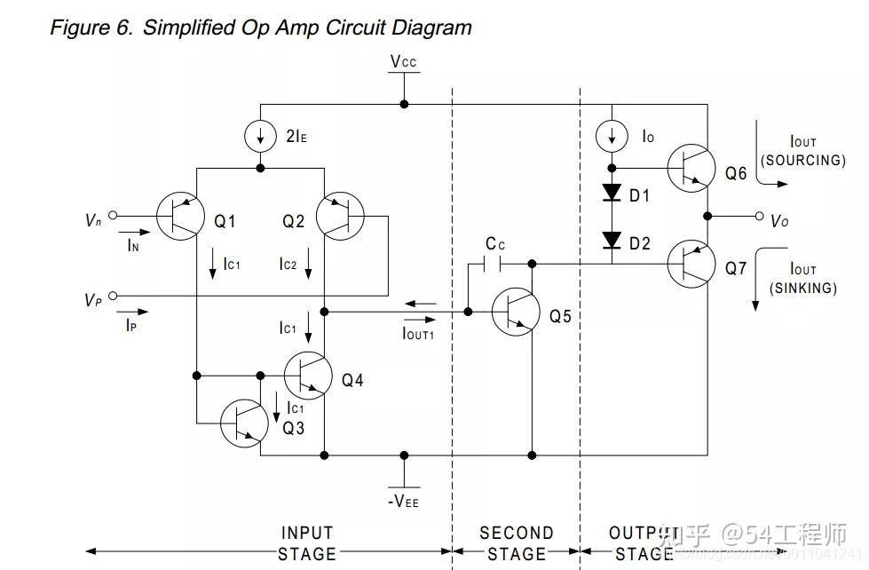
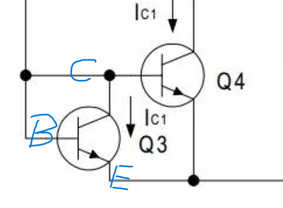

# 运算放大器

> 运放是一种高增益电压放大器，通过外接反馈网络可实现信号放大、滤波、比较等多种功能.

## 基本原理

- **输入段**
  - 基本原理：由一对特性相同的晶体管（BJT或FET,下以三极管为例）构成 **差分放大电路**。它只放大两个输入端之间的电压差（差模信号），而对两个输入端上相同的电压变化（共模信号）有很强的抑制作用。
  - 目的：**接收**外部输入电压信号，并**抑制**共模干扰（如温度变化、电源噪声对两个输入端的影响），同时提供极高的输入阻抗以**减少对信号源的影响**。
    - Q1 - Q2(PNP三极管)：接收信号\
        两发射极接到同一个恒流源，两发射极流入电流之和 *2IE* 不变；两基极分别连接输入的 *Vn*、*Vp*， 分别流过电流 *In*、*Ip*；两集电极分别流出电流 *Ic1*、*Ic2*，有 *2IE = Ic1 + Ic2*（忽略在在三级管内被消耗的）。由三极管基本原理易知，集电极流出电流与基极流入电流成正比。于是有 *Ic1 : Ic2 = In : Ip*。\
    *2IE* 较大，由此将输入信号 *In*、*Ip* 之差，放大为 *Ic1*、*Ic2* 之差。
    - Q3 - Q4(NPN三极管)：整合信号\
        Q3 、Q4 组成 *电流镜*，通过 Q4 电流等于通过 Q3 电流 *Ic1*。流出 Q2 电流 *Ic2 = Ic1 + Iout1*，于是有 *Iout1 = Ic2 - Ic1*。\
        **两个集电极的差分对电流变化，被优雅地转换成了一个单端输出的电压变化，便于后续中间级处理。**
        > 应尽可能保证 Q1 与 Q2、Q3 与 Q4拥有相同的物理特性。

- **中间段**
  - 基本原理：通过晶体管与后续输出端中的恒流源配合，将来自输入段的微弱电流波动转化为极大的电压摆幅，从而实现运算放大器核心的电压放大任务并确保电路稳定。
  - 目的：将输入段弱信号、高阻抗的电流转化为提供给输出段的强电压驱动信号。
  - Q5：放大信号
    - Q5 本身的电流增益：*Iout1* 的变化被放大为流经 Q5 的电流的变化。
    - 恒流源带来的 *阻抗杠杆*：\
        恒流源阻抗巨大，这意味着其流出电流 *Io* 几乎不变，而 *Io* 等于流向 Q5 与 Q7 的电流（ *I5*、*I7* ）之和。当 *Iout1* 变化使 *I5* 发生变化时，Q5 集电极电势将发生变化，以使 *I7* 发生相适应的变化。就结果而言，这会使 Q5 集电极电势发生很大变化，从而是实现

  > 电流镜：
  > ---
  > 
  > - Q3：其基极（ B ）与集电极（ C ）短接，两级电势相同。此时 Q3 稳  工作在放大区的极限边缘，集电极与发射极（ E ）压差 *Vce* 仅与流过电流  *Ic1* 相关且二者成正比。**当 *Ic1* 一定时**，*Vce = Vbe* 一定，又  为发射极接地，**集电极电势一定**。\
    **总结：*Ic1* 确定 *Vce***。
  > - Q4：其基极与发射极同 Q3 对应的极短接，二者 *Vbe* 相同。此时 Q3   稳定工作在放大区，其集电极与发射极压差 *Vce* 仅与流过电流相关且二者  正比。*Vce* 一定时，流过电流一定，又因 *Vce_Q4* 等于 *Vce_Q3*，所  二者流过电流相等，同为 *Ic1*。\
    **总结：*Vce* 确定 *Ic1***。
  > - **综上：流过 Q4 电流始终与流过 Q3 电流 *Ic1* 相等。**